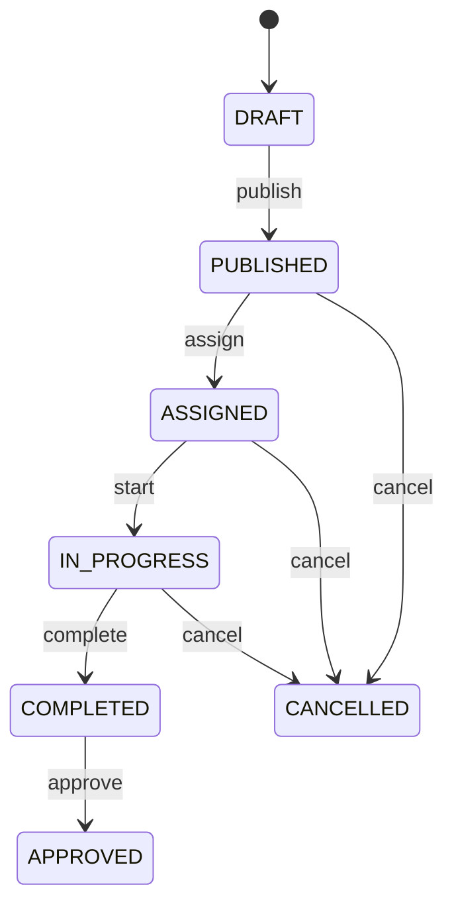
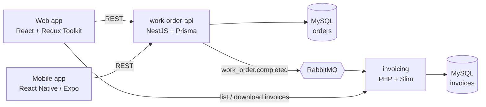

# WorkLoop

A field-service work-order marketplace. Companies post jobs, technicians apply and get assigned, and completed work generates invoices asynchronously.

## How it works

1. A company creates a work order and publishes it.
2. Technicians apply; the company assigns one of them.
3. The technician starts the job and marks it complete.
4. The company approves the completed work.
5. Completion triggers an event, and the invoicing service generates a PDF invoice.

Every work order follows a strict lifecycle. Any transition not shown below is rejected with `409 Conflict`.



## Architecture



- **work-order-api** owns users, companies, work orders and applications. Events are written to an outbox table in the same transaction as the status change, so none are lost if the broker is unavailable.
- **invoicing** consumes events, skips duplicates (idempotent processing), and generates invoice PDFs.
- Each service has its own database and never reads the other's.

## Tech stack

| Area               | Technologies                                |
| ------------------ | ------------------------------------------- |
| Backend            | NestJS, TypeScript, Prisma, PHP 8, Slim 4   |
| Frontend           | React, Vite, Redux Toolkit, RTK Query, SASS |
| Mobile             | React Native (Expo)                         |
| Data and messaging | MySQL 8, RabbitMQ                           |
| Infrastructure     | Docker Compose, Kubernetes, GitHub Actions  |
| Observability      | OpenTelemetry, Prometheus, Grafana, Jaeger  |
| Testing            | Jest, Supertest, PHPUnit                    |

## Project structure

```
workloop/
├── services/
│   ├── work-order-api/      # NestJS API (core domain)
│   └── invoicing/           # PHP invoicing service
├── apps/
│   ├── web/                 # React web client
│   └── mobile/              # React Native technician app
├── packages/
│   └── shared-types/        # Domain types and state machine shared across apps
├── infra/                   # Docker Compose, Kubernetes, observability config
└── docs/                    # Architecture and decision records
```

## Getting started

Requires Node 20+ and pnpm.

```bash
pnpm install
pnpm check
```

`pnpm check` runs formatting, linting, type checking and tests.

## Documentation

- [Architecture and domain model](docs/architecture.md)
- [Architecture decision records](docs/adr/README.md)
