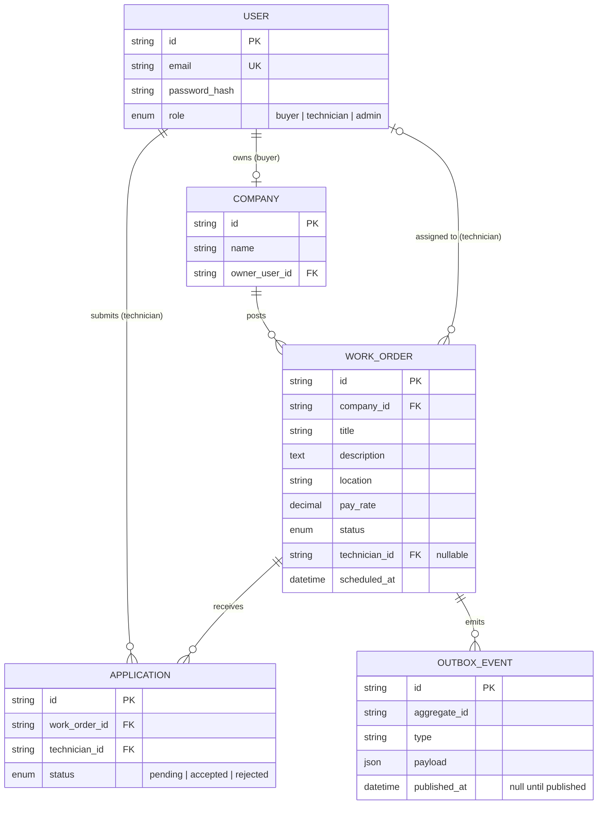
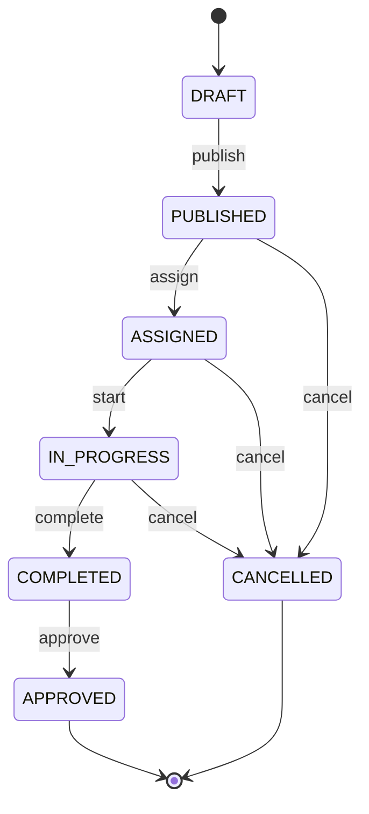

# Architecture

## Services and ownership

| Service                   | Owns                                                | Talks to others via                        |
| ------------------------- | --------------------------------------------------- | ------------------------------------------ |
| `work-order-api` (NestJS) | Users, companies, work orders, applications, outbox | REST (inbound), RabbitMQ events (outbound) |
| `invoicing` (PHP/Slim)    | Invoices, processed-event log                       | RabbitMQ events (inbound), REST (inbound)  |

Each service has its **own database**. The invoicing service never reads work-order tables; it only knows what arrives in events.

## Domain model

`INVOICE` (id, work_order_id, amount, status, pdf_path) lives in the **invoicing database**. Its `work_order_id` is a plain value copied from the event, not a foreign key, because the two tables are in different databases.

## Work-order state machine

Rules:

- Implemented as a pure function in [`packages/shared-types/src/work-order/state-machine.ts`](../packages/shared-types/src/work-order/state-machine.ts). It has no framework or database code, and every status/action pair is unit tested.
- Any transition not in the table throws `InvalidTransitionError`, which the API maps to **409 Conflict**.
- Applying for a job creates an `Application`; it does **not** change the work order's status.
- `DRAFT` cannot be cancelled. A draft was never visible to anyone, so it is deleted instead.
- `COMPLETED` cannot be cancelled. Reversing finished work is a dispute process, not a status change.

## Open questions

- Who may `approve`: only the company owner, or any buyer in the company?
- Can a technician withdraw after being assigned? If so, does the order go back to `PUBLISHED` (a new `unassign` action)?
